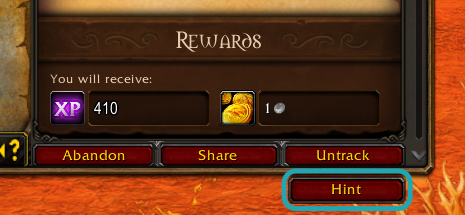
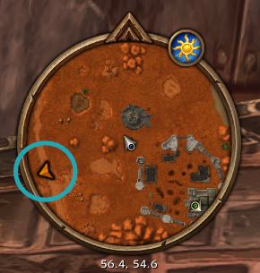
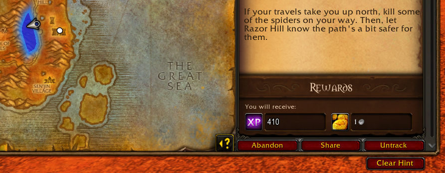
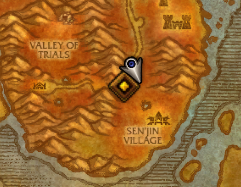

# Just a Hint


Just a Hint is a restrained quest tracker that does nothing unless you ask for a hint. It gives you more specific hints as you get closer, but only if you ask.

That way your brain can stay engaged with, and immersed in, the game world.

Just a Hint activates automatically. It keeps Blizzard's quest list and objective counts on the right, hides its guidance buttons and disables automatic navigation, map objectives and minimap quest markers. Click a quest to open the Map & Quest Log; request hints there.

[Download 0.7.7 RC3](https://github.com/DavidMann10k/just_a_hint/releases/tag/v0.7.7) · [Install](docs/INSTALL.md) · [Report a bug](https://github.com/DavidMann10k/just_a_hint/issues)

Target: **Forever beta 1.60.1 / build 70235 / interface 16001**.

Extract `JustAHint.zip` into `Interface/AddOns`, enable the addon and restart the client. No startup command is required. Activation waits for combat to end if necessary.

## Using Just a Hint

Click a quest in the list on the right, or open the Map & Quest Log and select one. **Hint** appears below the normal quest controls when a usable destination exists on your current map. Read the quest normally; assistance begins when you press the button. The button is disabled while location data loads.



If you're some distance away, a request closes the map and sends an arrow from screen center to the minimap. With chat feedback enabled, you also get a direction and a rough distance:


The gold arrow on the minimap's edge points toward the requested objective. Follow that bearing while you explore.



As you get close, the arrow disappears with a minimap ping and two green minimap pulses. It stays cleared until your next request. Open the same quest in the Map & Quest Log and press **Hint** again when you want a local clue. For a quest with a search area, the map highlights that area so you can search it yourself.



If the objective is a point, or an area cannot be confirmed, the nearby hint shows a location pin. Treat it as a place to look around; the native coordinate may not be an exact NPC position. A first request made nearby can show either local clue directly.



The button becomes **Clear Hint** while that quest has visible guidance. Press it when you've seen enough. Closing the map clears an area or pin; reopening it leaves the hint cleared.

Only one hint is active. Reading another quest preserves it; requesting another replaces it. Completing a quest step, zoning or reloading clears guidance. A turn-in needs a new request.

Sound and minimap pulses can be disabled independently in `/jah`. Arrival feedback acknowledges the cleared direction; it adds no map detail. Manual clearing and other cleanup stay quiet.

The cyan outlines around the button and minimap arrow are screenshot annotations.

## Controls

| Command | Function |
| --- | --- |
| `/jah` | Settings: arrow flight, pulses, sound and chat. |
| `/jah clear` | Clear the current hint. |
| `/jah restore` | Disable Just a Hint and restore saved Blizzard guidance settings. |
| `/jah status` | Copyable diagnostic report. |

Run `/jah restore` out of combat on each activated character before disabling or removing the addon. Restoration keeps Just a Hint disabled across reloads; `/jah start` re-enables it.

Report bugs and feedback through [GitHub Issues](https://github.com/DavidMann10k/just_a_hint/issues/new/choose). For bugs, include reproduction steps and addon/client versions; `/jah status` helps. For feedback, tell us whether the hint helped you keep exploring or gave too much away.

## Development

Python 3.11+ and Lua 5.1 or LuaJIT. Windows, macOS and Linux.

```text
python dev.py test
python dev.py build --interface 16001
python dev.py configure
python dev.py deploy
```

`deploy` checks, builds and installs the addon with a rollback backup. Native quest data supplies hints; no external quest database or service is required.

[Development](docs/DEVELOPMENT.md) · [Releasing](docs/RELEASING.md) · [Contributing](CONTRIBUTING.md) · [Design](DESIGN.md) · [Client checks](docs/CLIENT_TEST_PLAN.md) · [API findings](API_FINDINGS.md) · [Branding](docs/branding/README.md) · [MIT license](LICENSE)

Just a Hint is an unofficial community addon, unaffiliated with and not endorsed by Blizzard Entertainment. World of Warcraft and Warcraft are trademarks of Blizzard Entertainment, Inc.
